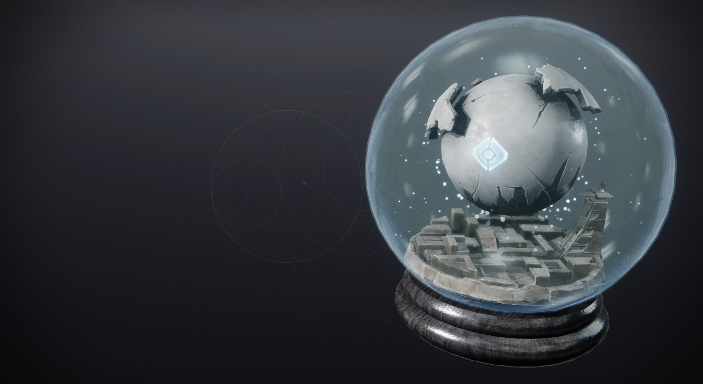

# 命运2 · 机灵外壳全图鉴 | Destiny 2 Ghost Shell Compendium

收录当前版本全部 **586** 件机灵外壳（机壳）——守护者伙伴「机灵」的外部装甲。
包含异域 / 传说 / 罕见 / 普通全部稀有度，附中英文名称、双语风味文本与获取来源。

**在线浏览**: https://imz-a.github.io/destiny2-ghost-shells/

## 功能 / Features

- 「什么是机壳」30 秒入门指南（可折叠）· Beginner's guide for non-players
- 英雄区精选渲染图轮播 · Hero carousel of featured shells
- 名称 / 风味文本 / Hash 搜索 · Search by name, flavor text or hash
- 稀有度筛选 + 排序 + 随机一览 + 卡片密度调节 · Rarity filter, sort, random pick, density slider
- 详情弹窗：渲染图、双语风味文本、来源、一键复制 Hash、跳转 wiki / light.gg

## 数据来源 / Data

- 数据取自 Bungie.net 官方公开 Manifest（版本 244213.26.06.29.2000-1）
- 图像素材 © Bungie, Inc. 保留所有权利。本页为粉丝作品，非官方站点。
- 检索与字段结构参考 [命运2中文维基 · 物品检索器](https://mingyun2.huijiwiki.com/wiki/CustomSearch?subType=17)

Destiny 2 is a trademark of Bungie, Inc. This is a fan-made compendium.
